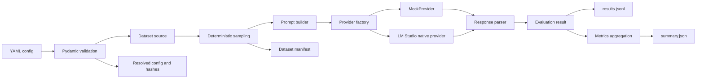

# LLM Benchmark

LLM Benchmark is a Python 3.12 project for running reproducible,
multiple-choice evaluations across language-model service profiles. Its goal is
to compare response quality, token usage, latency, reliability, and eventually
cost under consistent datasets, prompts, parameters, and measurement rules.

The current release is a small proof of concept. It preserves deterministic
offline validation with `MockProvider` and adds an opt-in LM Studio native API
path for a manually started local model.

> [!WARNING]
> `MockProvider` accuracy, token, and latency values are synthetic pipeline
> validation results. They do not measure or represent real LLM performance.

## Current status

Completed and validated:

- Python 3.12 package using a `src/` layout.
- Strict, immutable Pydantic configuration loaded from YAML.
- CLI overrides with `built-in defaults < YAML < CLI` precedence.
- Project-owned offline fixture dataset.
- Pinned `TIGER-Lab/MMLU-Pro` Hugging Face loader.
- Deterministic smoke and category-balanced POC sampling profiles.
- Versioned prompt construction and deterministic multiple-choice parsing.
- Deterministic `MockProvider` success, incorrect, unparseable,
  failed-request, and missing-token scenarios.
- Append-friendly JSONL results and derived JSON summaries.
- Quality, token, latency, reliability, and category-level metrics.
- Redacted resolved configuration, dataset manifest, environment snapshot,
  hashes, and a combined run fingerprint.
- Offline unit and integration suite with 34 passing tests.
- A completed pinned 14-sample MMLU-Pro smoke validation using MockProvider.
- An isolated LM Studio native `POST /api/v1/chat` provider with explicit
  reasoning mode and mocked offline tests.

## Current non-goals

The current increment intentionally does not include:

- OpenAI-compatible, OpenAI, Gemini, vLLM, or other provider adapters.
- API keys or credential management. The local LM Studio slice uses no
  authentication and remains bound to localhost.
- Retry execution, concurrency, rate limiting, or resumable work queues.
- Streaming or time-to-first-token measurements.
- Pricing tables or cost calculation.
- RAG, tool-calling, embeddings, free-text, or code-generation evaluation.
- LLM-as-a-judge or human evaluation.
- A database, backend service, web interface, CI/CD, Docker, or deployment
  infrastructure.

## Architecture overview

The benchmark core separates configuration, datasets, prompts, provider calls,
parsing, evaluation, storage, metrics, and reproducibility metadata.



See [Architecture](docs/architecture.md) for component responsibilities,
provider boundaries, and the phased design.

## Requirements and installation

- Python `>=3.12,<3.13`
- Git
- Network access only when installing packages or initially downloading
  MMLU-Pro

Create and activate a virtual environment on Windows PowerShell:

```powershell
py -3.12 -m venv .venv
.\.venv\Scripts\Activate.ps1
python -m pip install --upgrade pip
python -m pip install -e ".[dev,huggingface]"
```

For fixture-only development, the Hugging Face dependency is optional:

```powershell
python -m pip install -e ".[dev]"
```

No API key is required for the implemented workflows.

## Run the offline tests

The standard suite does not require network access:

```powershell
python -m pytest -m "not network"
```

To force Hugging Face libraries into offline mode in PowerShell:

```powershell
$env:HF_HUB_OFFLINE = "1"
$env:HF_DATASETS_OFFLINE = "1"
python -m pytest -m "not network"
```

## Run the offline fixture benchmark

```powershell
python -m llm_benchmark run --config configs/mock_smoke.yaml
```

This run uses eight project-owned synthetic questions and two deterministic
mock model profiles. It requires no network access or credentials.

## Run the MMLU-Pro smoke validation

Review [the smoke configuration](configs/mmlu_pro_smoke.yaml) before running:

```powershell
python -m llm_benchmark run --config configs/mmlu_pro_smoke.yaml
```

The configuration uses:

- Dataset: `TIGER-Lab/MMLU-Pro`
- Pinned revision: `475d58ba0cc18a15fd5d4221f41919199e692331`
- Split: `test`
- Seed: `42`
- Profile: `smoke`
- Sample count: `14`
- Provider: `MockProvider` only

The first run may download the official dataset into the Hugging Face cache.
Subsequent runs can use the cache. The POC and full profiles are not required
for smoke validation.

## Run the opt-in LM Studio fixture smoke

This command is intentionally not part of the offline test suite. Start the
validated LM Studio model locally, review
[the local model setup](docs/local-model-setup.md), and then run:

```powershell
python -m llm_benchmark run --config configs/lm_studio_fixture_smoke.yaml
```

The config schedules exactly one synthetic fixture question and sends one
native request to `http://127.0.0.1:1234/api/v1/chat` with model
`qwen3.5-0.8b`, reasoning `off`, temperature `0`, and 128 maximum output tokens.
It also sends `store=false`, so the request does not create persistent native
chat state. Only native output items with `type="message"` are scored;
reasoning items are never treated as the final answer. No API key is used.

The canonical prompt response is exactly one uppercase option label and no
other text. The allowed label range is derived from each question, including
A–J when present. The strict parser retains exact `FINAL ANSWER: <label>`
support for backward compatibility but rejects approximate markers and
semantic prose. Stop reason is recorded when supplied; otherwise it is null.

## Output artifacts

Every run creates an ignored directory under `outputs/<run_id>/` containing:

| File | Purpose |
| --- | --- |
| `results.jsonl` | One append-friendly record per model and sample |
| `summary.json` | Overall, per-model, and per-model-category metrics |
| `resolved_config.json` | Fully validated, secret-free run configuration |
| `dataset_manifest.json` | Dataset provenance and selected sample metadata |
| `environment.json` | Python, package, OS, and Git environment metadata |

Generated runs are intentionally excluded from Git; only
`outputs/.gitkeep` is tracked.

## Metrics

The current summary includes:

- `accuracy` across all scheduled results.
- `answered_accuracy` across parseable answers.
- Request and parse success rates.
- Format-failure and request-failure counts.
- Prompt, completion, and total token usage.
- Native input, total-output, and reasoning-output token totals when reported.
- Tokens per second and time to first token when reported by LM Studio.
- Missing-token-usage count and token efficiency metrics.
- Mean, P50, P95, minimum, and maximum logical-request latency for successful
  requests.
- Separate failed-request latency and error-type distribution.
- Run wall time.
- Model-level and category-level breakdowns.

Mock token counts use simple deterministic word counts, and mock latency is a
configured synthetic value; neither is provider telemetry.

## Reproducibility

Each run records:

- A strict `schema_version: 1` resolved configuration and canonical hash.
- Dataset source, pinned revision, split, seed, selected sample IDs,
  categories, sample count, license, and manifest hash.
- Prompt-template hash, parser version, and evaluator version.
- Python, OS, package, Git commit, and dirty-worktree metadata when available.
- A combined `run_fingerprint` derived from configuration, data, prompt,
  evaluator, parser, and Git revision inputs.

See [V1 assumptions](docs/assumptions.md) and
[Validation record](docs/validation.md) for the exact current protocol.

## Limitations

- The provider factory currently supports MockProvider and the LM Studio native
  API only; generic OpenAI compatibility remains separate and unimplemented.
- Retry fields exist in the result schema, but V1 executes one attempt only.
- Runs are sequential and cannot yet resume after interruption.
- JSONL has no database transaction or duplicate-work protection.
- MMLU-Pro licensing and citation metadata are currently encoded for the known
  dataset profile rather than fetched dynamically.
- Small-sample percentile values are calculated but are not accompanied by
  confidence intervals or minimum-sample warnings.
- No project license has been selected yet.

## Roadmap

1. Validate the isolated LM Studio native provider on the one-question fixture
   smoke, then compare two explicitly approved local model profiles.
2. Add attempt-level records, timeout handling, bounded retries, shared rate
   limiting, graceful shutdown, and safe resume.
3. Add versioned pricing, cost metrics, comparison exports, and a durable
   database backend.
4. Add structured-output and instruction-following evaluations.
5. Add tool-calling, embeddings/retrieval, RAG, and later open-ended evaluation.
6. Add optional human and calibrated LLM-judge workflows only where
   deterministic evaluation is insufficient.

No additional provider integration should proceed until endpoint access, model
IDs, credentials policy, and budget limits have been explicitly approved.
