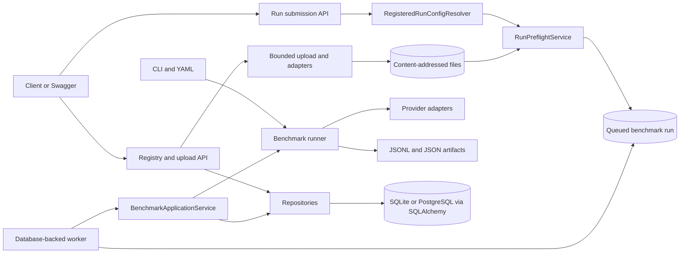

# LLM Benchmark

LLM Benchmark is a Python 3.12 backend proof of concept for reproducible
multiple-choice evaluation of language-model service profiles. In addition to
CLI execution, it provides registry persistence, queued benchmark APIs,
uploaded-dataset ingestion, and strict completed-run comparison. It keeps
quality, token usage, latency, reliability, and format compliance as separate
measurements under explicit datasets, prompts, parser versions, and request
parameters.

> [!WARNING]
> `MockProvider` scores and telemetry are synthetic software-validation
> results. They are not measurements of real LLM performance. The recorded
> single-sample, three-sample, and reasoning experiments are operational
> calibrations, not benchmark scores.

## Current implementation

- Strict, immutable Pydantic `schema_version: 1` YAML configuration with CLI
  overrides.
- Project-owned local JSONL fixture data and a pinned
  `TIGER-Lab/MMLU-Pro` Hugging Face source.
- Deterministic sampling, versioned prompts, a strict multiple-choice parser,
  deterministic evaluation, metrics, and reproducibility hashes.
- `MockProvider`, LM Studio native, and generic OpenAI-compatible provider
  adapters behind one normalized provider boundary.
- Append-friendly JSONL results and JSON summary, configuration, manifest, and
  environment artifacts.
- Synchronous SQLAlchemy 2.x persistence with SQLite for local/development use
  and Alembic migrations.
- Repositories and immutable application-facing records for registered
  endpoints, models, datasets, benchmark runs, and sample results.
- A provider-neutral FastAPI registry API, submission-only Run API, and a
  separate database-backed benchmark worker.
- A framework-independent `BenchmarkApplicationService`, safe registered
  `RunConfig` resolution, and pre-execution Run API guardrails.
- Bounded CSV/JSONL upload, SHA-256 content-addressed local storage, pandas
  adapters, portable dataset provenance, and execution of uploaded datasets
  through the existing benchmark pipeline.
- A framework-independent, read-only `BenchmarkComparisonService` for strict
  comparison of two completed runs.
- Docker Compose PostgreSQL integration runtime and Ruff lint tooling for local
  development.
- A forced-offline test snapshot of `411 passed, 2 skipped, 0 failed`,
  including the PostgreSQL integration tests.

## Architecture

The CLI and registered Run API share the benchmark runner but have different
orchestration and persistence boundaries.



See [Architecture](docs/architecture.md) for component, transaction, and
lifecycle details.

Strict comparison requires identical sample-ID populations and aligns samples
deterministically by `sample_id`. It reports quality, format compliance,
reliability, token usage, and latency separately at aggregate, category, and
sample levels. Model differences are expected; provider and generation-policy
differences are retained as interpretation context. No composite score is
generated. The service has no FastAPI comparison route yet; see
[Architecture](docs/architecture.md) and [Validation](docs/validation.md).

## Installation

Requirements:

- Python `>=3.12,<3.13`
- Git
- Network access only for dependency installation or an explicitly approved
  initial Hugging Face download

Windows PowerShell:

```powershell
py -3.12 -m venv .venv
.\.venv\Scripts\Activate.ps1
python -m pip install -e ".[dev]"
```

Add optional Hugging Face support when required:

```powershell
python -m pip install -e ".[dev,huggingface]"
```

## Offline tests

The complete suite can be forced offline:

```powershell
$env:HF_HUB_OFFLINE = "1"
$env:HF_DATASETS_OFFLINE = "1"
$env:TRANSFORMERS_OFFLINE = "1"
python -m pytest
```

Ruff is installed through the existing `dev` optional dependency group. The
recommended local validation order is to activate the project environment, run
the lint gate, then run pytest after forcing the three offline modes shown
above:

```powershell
& ".\.venv\Scripts\Activate.ps1"
ruff check .
pytest -q
```

The current Ruff gate performs linting only; `ruff format` is not enforced.
Ruff complements and does not replace the offline pytest suite.

The latest verified development snapshot is `411 passed, 2 skipped, 0
failed`. It includes all five PostgreSQL integration tests. The two
platform-dependent symlink/junction tests were skipped because symbolic-link
creation was unavailable in the Windows validation environment; the
deterministic physical-containment regression test passed. Older counts in the
validation history are labelled as historical checkpoints.

## CLI execution

Run the fully offline fixture pipeline:

```powershell
python -m llm_benchmark run --config configs/mock_smoke.yaml
```

The installed console entry point is equivalent:

```powershell
llm-benchmark run --config configs/mock_smoke.yaml
```

Explicit overrides are supported:

```powershell
llm-benchmark run --config configs/mock_smoke.yaml --set dataset.sample_size=4
```

CLI runs call the runner directly. They do not use the registry, database
repositories, application service, or Run API guardrails. In particular, the
CLI retains the configured `full` profile behavior.

## Dataset commands

Pinned MMLU-Pro MockProvider smoke:

```powershell
python -m llm_benchmark run --config configs/mmlu_pro_smoke.yaml
```

Cached local-model MMLU-Pro smoke:

```powershell
$env:HF_HUB_OFFLINE = "1"
$env:HF_DATASETS_OFFLINE = "1"
$env:TRANSFORMERS_OFFLINE = "1"
python -m llm_benchmark run --config configs/mmlu_pro_lm_studio_smoke.yaml
```

Local provider commands are opt-in and require an already running endpoint.
The benchmark does not download, load, start, stop, or orchestrate local
models. See [Local model setup](docs/local-model-setup.md).

## Persistence and migrations

The default development database URL is:

```text
sqlite:///runtime/llm_benchmark.db
```

It can be changed with `LLM_BENCHMARK_DATABASE_URL`. Actual credential values
must never be included in database URLs committed to the repository.

Apply the current migration:

```powershell
alembic upgrade head
```

This may create the ignored local runtime database. The schema contains:

- `provider_endpoints`
- `models`
- `datasets`
- `benchmark_runs`
- `sample_results`

The schema uses portable SQLAlchemy types and generic JSON fields. PostgreSQL
16 integration has been validated through Psycopg 3, Alembic, the synchronous
repositories, and the FastAPI application. SQLite remains the default
local/offline database.

## Running the API locally

Install the project and development dependencies into the existing virtual
environment:

```powershell
.\.venv\Scripts\python.exe -m pip install -e ".[dev]"
```

Configure an ignored development database, apply the migrations, and start
Uvicorn on localhost:

```powershell
$env:LLM_BENCHMARK_DATABASE_URL = "sqlite:///runtime/api_runtime_dev.db"
.\.venv\Scripts\python.exe -m alembic upgrade head
& ".\.venv\Scripts\python.exe" -m llm_benchmark.api
```

Equivalent explicit Uvicorn command:

```powershell
& ".\.venv\Scripts\python.exe" -m uvicorn llm_benchmark.api:create_app --factory --host 127.0.0.1 --port 8000
```

Database migrations must be applied before using database-backed routes. While
the server is running, the local documentation endpoints are:

- Swagger UI: <http://127.0.0.1:8000/docs>
- OpenAPI schema: <http://127.0.0.1:8000/openapi.json>
- ReDoc: <http://127.0.0.1:8000/redoc>

Press `Ctrl+C` to stop the server. A `404` response for `/` or `/favicon.ico`
is currently expected because those routes are not implemented. The documented
command binds Uvicorn only to `127.0.0.1`.

The API provides registry CRUD routes for provider endpoints, models, and
datasets, plus queued benchmark submission and result routes. Run the worker
in a second shell with the same database URL to process queued runs:

```powershell
& ".\.venv\Scripts\python.exe" -m llm_benchmark.worker
```

The bounded worker is appropriate for this POC but is not a production task
queue. Runtime SQLite databases and generated benchmark artifacts must remain
untracked.

## Running the API with Docker

The Docker POC uses Python 3.12 slim and runs the application as the non-root
`benchmark` user. Build the reusable image, start the migration and API
services, inspect their state, and stop them with:

```powershell
docker compose build
docker compose up
docker compose ps -a
docker compose down
```

Compose starts PostgreSQL 16, waits for its health check, and then runs
`python -m alembic upgrade head` in the separate `migrate` service. The `api`
and `worker` services start only after that migration completes successfully.
All three use the same PostgreSQL database. API and worker share uploaded
datasets through `benchmark_runtime` and generated artifacts through
`benchmark_outputs`; PostgreSQL data uses `postgres_data`. `docker compose
down` preserves all named volumes unless they are explicitly removed with a
volume-deletion option.

The Compose username and `llm_benchmark_dev` password are reproducible local
development placeholders, not production credentials. Production secrets,
pool tuning, backups, high availability, and deployment hardening are outside
this POC.

The container listens on `0.0.0.0:8000`, while Compose publishes the API only
on host address `127.0.0.1:8000`:

- Swagger UI: <http://127.0.0.1:8000/docs>
- OpenAPI schema: <http://127.0.0.1:8000/openapi.json>

The PostgreSQL Docker validation observed a healthy `postgres` service, a
successfully completed `migrate` service, and running `api` and `worker`
services. A single uploaded synthetic multiple-choice sample was submitted as
`queued`, claimed by the worker, and completed with one persisted correct
`MockProvider` result and the expected artifacts. Restarting the worker did not
execute that completed run again. This validates bounded claim behavior, not
general crash recovery or production readiness.

## Registry CRUD API

The FastAPI application factory is:

```python
from llm_benchmark.api import create_app

app = create_app()
```

Registered endpoints, models, and datasets expose create, active-only list,
individual get, partial update, and soft-delete routes under `/api/v1`:

```text
POST   /api/v1/endpoints
GET    /api/v1/endpoints
GET    /api/v1/endpoints/{id}
PATCH  /api/v1/endpoints/{id}
DELETE /api/v1/endpoints/{id}

POST   /api/v1/models
GET    /api/v1/models
GET    /api/v1/models/{id}
PATCH  /api/v1/models/{id}
DELETE /api/v1/models/{id}

POST   /api/v1/datasets
POST   /api/v1/datasets/upload
GET    /api/v1/datasets
GET    /api/v1/datasets/{id}
PATCH  /api/v1/datasets/{id}
DELETE /api/v1/datasets/{id}
```

Only credential environment-variable names may be registered. API keys,
passwords, bearer tokens, and other secret values are rejected and are not
stored. Uvicorn is available for the documented local/Docker POC runtime, but
the API is not production-ready.

## Uploaded dataset API

`POST /api/v1/datasets/upload` accepts one `multipart/form-data` file plus:

- `name`
- `file_format`: `csv` or `jsonl`
- `split` (default `test`)
- optional `revision`
- optional `license`

The server streams the file with a bounded size policy, computes SHA-256,
validates and normalizes it, stores it beneath the configured runtime dataset
root, and creates a dataset registration. SQLite stores metadata rather than
the uploaded rows. `source_uri` is an opaque key such as
`upload://sha256/<64-lowercase-hex>.csv`; the checksum and adapter type are
also registered. Physical dataset paths are not portable provenance.

CSV requires `sample_id`, `question`, `correct_answer`, `category`, and at
least two contiguous ordered option columns beginning with `option_A` and
ending no later than `option_J`. JSONL requires `sample_id`, `question`, an
`options` list, `correct_answer`, and `category`. IDs must be unique; textual
fields must be non-empty; and `correct_answer` must match a label derived from
the ordered available options.

Small synthetic CSV example:

```csv
sample_id,question,option_A,option_B,correct_answer,category
demo-1,Which option is second?,First,Second,B,synthetic
```

Equivalent JSONL shape:

```json
{"sample_id":"demo-1","question":"Which option is second?","options":["First","Second"],"correct_answer":"B","category":"synthetic"}
```

Before uploaded content is benchmarked, its opaque key and registered checksum
must agree with the actual file digest. The resolved file must remain beneath
the resolved storage root, so escaping symlink/junction targets are rejected.
Verification itself creates no files or directories. Valid content is returned
as the same `DatasetExample` representation used by the benchmark pipeline.

## API workflow

The registered workflow is:

1. `POST /api/v1/endpoints` with `name`, `provider_type`, `base_url`, and an
   optional `credential_env_var`.
2. `POST /api/v1/models` with `name`, `model_identifier`, `endpoint_id`, and
   `reasoning_policy` plus optional capability/default metadata.
3. `POST /api/v1/datasets/upload` with the multipart fields above; retain the
   returned dataset `id`.
4. `POST /api/v1/runs` with `experiment_name`, `model_id`, `dataset_id`, and
   optional `seed`, `profile`, `sample_size`, `sample_ids`, or
   `category_filter`.
5. The separate worker atomically claims the queued run and executes it.
6. Poll `GET /api/v1/runs/{run_id}` for queued, running, completed, or failed
   state and the eventual summary.
7. `GET /api/v1/runs/{run_id}/results` for persisted sample outcomes.

Creates return HTTP `201`; successful get/list operations return HTTP `200`.
Registry routes manage registrations, the upload route stores and registers
portable provenance, and Run routes resolve registrations, preflight the exact
selection, and persist a queued submission. Provider execution is outside the
API request.

## Queued registered Run API

```text
POST /api/v1/runs
GET  /api/v1/runs
GET  /api/v1/runs/{run_id}
GET  /api/v1/runs/{run_id}/results
```

Clients select registered model and dataset IDs. They cannot directly override
the provider, endpoint URL, credential value, model identifier, physical
dataset path, storage root, dataset source URI, checksum, adapter type,
artifact path, or output root. `RegisteredRunConfigResolver` constructs a
validated configuration from active registrations.

Before any run record is created, `RunPreflightService` applies the default
bounded API policy:

- `smoke` and `poc` are allowed.
- `full` is rejected by the Run API only.
- `max_selected_samples=100`.
- `max_sample_ids=100`.
- The dataset is loaded and existing sampling rules produce the exact
  selection.
- Unknown sample IDs, unknown categories, mixed valid/invalid categories, and
  empty selections are rejected.

A rejected preflight performs no provider call and creates no benchmark-run
row, sample-result row, or artifact directory. An accepted POST returns HTTP
`201` with `status=queued`, persists the exact preflight-selected sample count,
and leaves summary/start/completion fields null. It creates neither samples nor
artifacts. Clients poll the run GET route while the worker executes separately.

## Run lifecycle and durability

For an accepted registered run, `BenchmarkApplicationService` preserves short
transactions:

```text
queued transaction in the API request
-> atomic worker claim and running transaction
-> provider execution outside the API request with no open database transaction
-> atomic sample_results transaction
-> completed or failed transaction
```

Unparseable and request-failed samples are benchmark outcomes when the pipeline
completes; they are not orchestration failures.

CLI artifacts and API database records have different guarantees:

- CLI: artifacts under `outputs/<run_id>/`; JSONL append and JSON replacement
  are not one database transaction.
- Registered Run API: artifacts under `outputs/api/<run_id>/` plus durable run
  and sample records. Sample rows are written atomically, but database and
  filesystem artifacts do not form one cross-storage transaction.

Generated outputs, runtime databases, downloaded datasets, model weights, and
local caches are ignored by Git.

## Providers

- `MockProvider`: deterministic, offline, synthetic validation only.
- `LMStudioProvider`: native `POST /api/v1/chat`, explicit native reasoning
  mode, `store=false`, and message-only scoring.
- `OpenAICompatibleProvider`: `POST {base_url}/chat/completions`, optional
  request-time Bearer credential resolution, and no unverified native
  reasoning fields.

Reasoning content is never parsed as the final answer unless it is also
present in the provider's standard final-message field. Missing telemetry is
stored as null rather than invented.

## Datasets and attribution

The local fixture contains eight project-owned synthetic multiple-choice
questions. Its output is software-validation data, not a model score.

Uploaded CSV/JSONL datasets are stored in ignored runtime storage and are not
tracked by Git. Their registration records retain an opaque storage key,
checksum, adapter, split, license when supplied, and compact metadata; complete
dataset rows are not copied into SQLite.

The real benchmark source is:

- Dataset: `TIGER-Lab/MMLU-Pro`
- Homepage: <https://huggingface.co/datasets/TIGER-Lab/MMLU-Pro>
- Pinned revision: `475d58ba0cc18a15fd5d4221f41919199e692331`
- Evaluated split: `test`
- Citation: MMLU-Pro, arXiv:2406.01574
- Recorded dataset license metadata: `MIT`

The dataset is not redistributed in this repository. Dataset licensing and
project licensing are separate and must be reviewed independently.

## Metrics and reproducibility

Current outputs include quality counts and rates, token usage, provider-reported
reasoning/final-output telemetry, successful and failed latency distributions,
run wall time, logical-duration sum, error distributions, category breakdowns,
resolved-config hash, dataset-manifest hash, prompt hash, parser/evaluator
versions, environment metadata, and a combined run fingerprint. Pricing and
cost calculation are not implemented.

## Security boundaries and limitations

- No authentication or authorization.
- One worker processes runs sequentially. There is no retry, lease, heartbeat,
  stale-run recovery, cancellation, resume, concurrency, rate limiting, or
  pagination.
- No endpoint SSRF allowlist or local dataset-root allowlist.
- No explicit Hugging Face cache-only/download policy in the API.
- Preflight and execution currently load the dataset independently.
- Uploaded files currently use local disk storage; there is no object storage
  or distributed locking.
- Generic registry CRUD is an administrative trust boundary that still needs
  explicit hardening and authorization.
- No streaming transport.
- No production deployment configuration.
- Sample-result API responses include raw model responses and should not be
  exposed to untrusted users.
- Public run responses omit persisted internal failure messages and expose
  only the high-level error type.
- Actual secrets are never persisted; only credential environment-variable
  names may be stored.
- The evaluation task is currently multiple-choice only.

## Validation and roadmap

Historical local-model and reasoning calibration results are recorded in
[Validation](docs/validation.md). They describe specific local configurations
and do not establish statistical model quality, general provider reliability,
or production readiness.

The strict framework-independent comparison service is complete but has no API
route yet. The bounded queued-run worker is also implemented. Suggested next
increments are authentication/authorization and explicit worker reliability
policies only after the current contracts stabilize. Comparison API, leases,
heartbeat/stale recovery, retry/resume, pricing, and additional deterministic
task families remain future work.

No project license has been selected yet.
