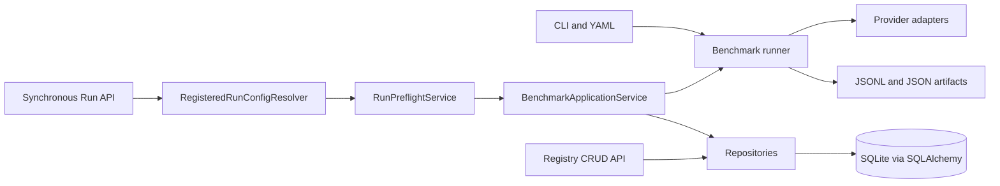

# LLM Benchmark

LLM Benchmark is a Python 3.12 proof of concept for reproducible
multiple-choice evaluation of language-model service profiles. It keeps
quality, token usage, latency, reliability, and format compliance as separate
measurements under explicit datasets, prompts, parser versions, and request
parameters.

> [!WARNING]
> `MockProvider` scores and telemetry are synthetic software-validation
> results. They are not measurements of real LLM performance. The recorded
> single-sample, three-sample, and reasoning experiments are operational
> calibrations, not benchmark scores.

## Current implementation

- Strict, immutable Pydantic `schema_version: 1` YAML configuration with CLI
  overrides.
- Project-owned local JSONL fixture data and a pinned
  `TIGER-Lab/MMLU-Pro` Hugging Face source.
- Deterministic sampling, versioned prompts, a strict multiple-choice parser,
  deterministic evaluation, metrics, and reproducibility hashes.
- `MockProvider`, LM Studio native, and generic OpenAI-compatible provider
  adapters behind one normalized provider boundary.
- Append-friendly JSONL results and JSON summary, configuration, manifest, and
  environment artifacts.
- Synchronous SQLAlchemy 2.x persistence with SQLite for local/development use
  and Alembic migrations.
- Repositories and immutable application-facing records for registered
  endpoints, models, datasets, benchmark runs, and sample results.
- A provider-neutral FastAPI registry API and synchronous registered Run API.
- A framework-independent `BenchmarkApplicationService`, safe registered
  `RunConfig` resolution, and pre-execution Run API guardrails.
- A framework-independent, read-only `BenchmarkComparisonService` for strict
  comparison of two completed runs.
- A forced-offline test snapshot of `234 passed, 0 failed`.

## Architecture

The CLI and registered Run API share the benchmark runner but have different
orchestration and persistence boundaries.



See [Architecture](docs/architecture.md) for component, transaction, and
lifecycle details.

Strict comparison requires identical sample-ID populations and aligns samples
deterministically by `sample_id`. It reports quality, format compliance,
reliability, token usage, and latency separately at aggregate, category, and
sample levels. Model differences are expected; provider and generation-policy
differences are retained as interpretation context. No composite score is
generated. The service has no FastAPI comparison route yet; see
[Architecture](docs/architecture.md) and [Validation](docs/validation.md).

## Installation

Requirements:

- Python `>=3.12,<3.13`
- Git
- Network access only for dependency installation or an explicitly approved
  initial Hugging Face download

Windows PowerShell:

```powershell
py -3.12 -m venv .venv
.\.venv\Scripts\Activate.ps1
python -m pip install -e ".[dev]"
```

Add optional Hugging Face support when required:

```powershell
python -m pip install -e ".[dev,huggingface]"
```

## Offline tests

The complete suite can be forced offline:

```powershell
$env:HF_HUB_OFFLINE = "1"
$env:HF_DATASETS_OFFLINE = "1"
$env:TRANSFORMERS_OFFLINE = "1"
python -m pytest
```

The latest verified development snapshot is `234 passed, 0 failed`. Older
counts in the validation history are labelled as historical checkpoints.

## CLI execution

Run the fully offline fixture pipeline:

```powershell
python -m llm_benchmark run --config configs/mock_smoke.yaml
```

The installed console entry point is equivalent:

```powershell
llm-benchmark run --config configs/mock_smoke.yaml
```

Explicit overrides are supported:

```powershell
llm-benchmark run --config configs/mock_smoke.yaml --set dataset.sample_size=4
```

CLI runs call the runner directly. They do not use the registry, database
repositories, application service, or Run API guardrails. In particular, the
CLI retains the configured `full` profile behavior.

## Dataset commands

Pinned MMLU-Pro MockProvider smoke:

```powershell
python -m llm_benchmark run --config configs/mmlu_pro_smoke.yaml
```

Cached local-model MMLU-Pro smoke:

```powershell
$env:HF_HUB_OFFLINE = "1"
$env:HF_DATASETS_OFFLINE = "1"
$env:TRANSFORMERS_OFFLINE = "1"
python -m llm_benchmark run --config configs/mmlu_pro_lm_studio_smoke.yaml
```

Local provider commands are opt-in and require an already running endpoint.
The benchmark does not download, load, start, stop, or orchestrate local
models. See [Local model setup](docs/local-model-setup.md).

## Persistence and migrations

The default development database URL is:

```text
sqlite:///runtime/llm_benchmark.db
```

It can be changed with `LLM_BENCHMARK_DATABASE_URL`. Actual credential values
must never be included in database URLs committed to the repository.

Apply the current migration:

```powershell
alembic upgrade head
```

This may create the ignored local runtime database. The schema contains:

- `provider_endpoints`
- `models`
- `datasets`
- `benchmark_runs`
- `sample_results`

The schema uses portable SQLAlchemy types and generic JSON fields with future
PostgreSQL migration in mind. PostgreSQL runtime behavior has not been
validated.

## Running the API locally

Install the project and development dependencies into the existing virtual
environment:

```powershell
.\.venv\Scripts\python.exe -m pip install -e ".[dev]"
```

Configure an ignored development database, apply the migrations, and start
Uvicorn on localhost:

```powershell
$env:LLM_BENCHMARK_DATABASE_URL = "sqlite:///runtime/api_runtime_dev.db"
.\.venv\Scripts\python.exe -m alembic upgrade head
& ".\.venv\Scripts\python.exe" -m llm_benchmark.api
```

Equivalent explicit Uvicorn command:

```powershell
& ".\.venv\Scripts\python.exe" -m uvicorn llm_benchmark.api:create_app --factory --host 127.0.0.1 --port 8000
```

Database migrations must be applied before using database-backed routes. While
the server is running, the local documentation endpoints are:

- Swagger UI: <http://127.0.0.1:8000/docs>
- OpenAPI schema: <http://127.0.0.1:8000/openapi.json>
- ReDoc: <http://127.0.0.1:8000/redoc>

Press `Ctrl+C` to stop the server. A `404` response for `/` or `/favicon.ico`
is currently expected because those routes are not implemented. The documented
command binds Uvicorn only to `127.0.0.1`.

The API provides registry CRUD routes for provider endpoints, models, and
datasets, plus synchronous in-process benchmark run and result routes. This
execution model is appropriate for the current POC; long-running production
execution will require a worker/task-queue design. Runtime SQLite databases and
generated benchmark artifacts must remain untracked.

## Registry CRUD API

The FastAPI application factory is:

```python
from llm_benchmark.api import create_app

app = create_app()
```

Registered endpoints, models, and datasets expose create, active-only list,
individual get, partial update, and soft-delete routes under `/api/v1`:

```text
POST   /api/v1/endpoints
GET    /api/v1/endpoints
GET    /api/v1/endpoints/{id}
PATCH  /api/v1/endpoints/{id}
DELETE /api/v1/endpoints/{id}

POST   /api/v1/models
GET    /api/v1/models
GET    /api/v1/models/{id}
PATCH  /api/v1/models/{id}
DELETE /api/v1/models/{id}

POST   /api/v1/datasets
GET    /api/v1/datasets
GET    /api/v1/datasets/{id}
PATCH  /api/v1/datasets/{id}
DELETE /api/v1/datasets/{id}
```

Only credential environment-variable names may be registered. API keys,
passwords, bearer tokens, and other secret values are rejected and are not
stored. The project does not currently include a production ASGI server
dependency or deployment command; the API is not production-ready.

## Synchronous registered Run API

```text
POST /api/v1/runs
GET  /api/v1/runs
GET  /api/v1/runs/{run_id}
GET  /api/v1/runs/{run_id}/results
```

Clients select registered model and dataset IDs. They cannot directly override
the provider, endpoint URL, credential, model identifier, dataset path,
artifact path, or output root. `RegisteredRunConfigResolver` constructs a
validated configuration from active registrations.

Before any run record is created, `RunPreflightService` applies the default
synchronous API policy:

- `smoke` and `poc` are allowed.
- `full` is rejected by the Run API only.
- `max_selected_samples=100`.
- `max_sample_ids=100`.
- The dataset is loaded and existing sampling rules produce the exact
  selection.
- Unknown sample IDs, unknown categories, mixed valid/invalid categories, and
  empty selections are rejected.

A rejected preflight performs no provider call and creates no benchmark-run
row, sample-result row, or artifact directory. The API remains synchronous and
in-process; the HTTP request stays open until execution completes.

## Run lifecycle and durability

For an accepted registered run, `BenchmarkApplicationService` preserves short
transactions:

```text
queued transaction
-> running transaction
-> provider execution with no open database transaction
-> atomic sample_results transaction
-> completed or failed transaction
```

Unparseable and request-failed samples are benchmark outcomes when the pipeline
completes; they are not orchestration failures.

CLI artifacts and API database records have different guarantees:

- CLI: artifacts under `outputs/<run_id>/`; JSONL append and JSON replacement
  are not one database transaction.
- Registered Run API: artifacts under `outputs/api/<run_id>/` plus durable run
  and sample records. Sample rows are written atomically, but database and
  filesystem artifacts do not form one cross-storage transaction.

Generated outputs, runtime databases, downloaded datasets, model weights, and
local caches are ignored by Git.

## Providers

- `MockProvider`: deterministic, offline, synthetic validation only.
- `LMStudioProvider`: native `POST /api/v1/chat`, explicit native reasoning
  mode, `store=false`, and message-only scoring.
- `OpenAICompatibleProvider`: `POST {base_url}/chat/completions`, optional
  request-time Bearer credential resolution, and no unverified native
  reasoning fields.

Reasoning content is never parsed as the final answer unless it is also
present in the provider's standard final-message field. Missing telemetry is
stored as null rather than invented.

## Datasets and attribution

The local fixture contains eight project-owned synthetic multiple-choice
questions. Its output is software-validation data, not a model score.

The real benchmark source is:

- Dataset: `TIGER-Lab/MMLU-Pro`
- Homepage: <https://huggingface.co/datasets/TIGER-Lab/MMLU-Pro>
- Pinned revision: `475d58ba0cc18a15fd5d4221f41919199e692331`
- Evaluated split: `test`
- Citation: MMLU-Pro, arXiv:2406.01574
- Recorded dataset license metadata: `MIT`

The dataset is not redistributed in this repository. Dataset licensing and
project licensing are separate and must be reviewed independently.

## Metrics and reproducibility

Current outputs include quality counts and rates, token usage, provider-reported
reasoning/final-output telemetry, successful and failed latency distributions,
run wall time, logical-duration sum, error distributions, category breakdowns,
resolved-config hash, dataset-manifest hash, prompt hash, parser/evaluator
versions, environment metadata, and a combined run fingerprint. Pricing and
cost calculation are not implemented.

## Security boundaries and limitations

- No authentication or authorization.
- No worker, queue, retry, concurrency control, rate limiting, resume, or
  pagination.
- No endpoint SSRF allowlist or local dataset-root allowlist.
- No explicit Hugging Face cache-only/download policy in the API.
- Preflight and execution currently load the dataset independently.
- No streaming transport.
- No production deployment configuration.
- Sample-result API responses include raw model responses and should not be
  exposed to untrusted users.
- Public run responses omit persisted internal failure messages and expose
  only the high-level error type.
- Actual secrets are never persisted; only credential environment-variable
  names may be stored.
- The evaluation task is currently multiple-choice only.

## Validation and roadmap

Historical local-model and reasoning calibration results are recorded in
[Validation](docs/validation.md). They describe specific local configurations
and do not establish statistical model quality, general provider reliability,
or production readiness.

The strict framework-independent comparison service is complete. The next
product-oriented increment is a safe Comparison API. Later increments include
operational authentication and URL/path policies, async execution, retry and
resume, PostgreSQL runtime validation, pricing, and additional deterministic
task families.

No project license has been selected yet.
