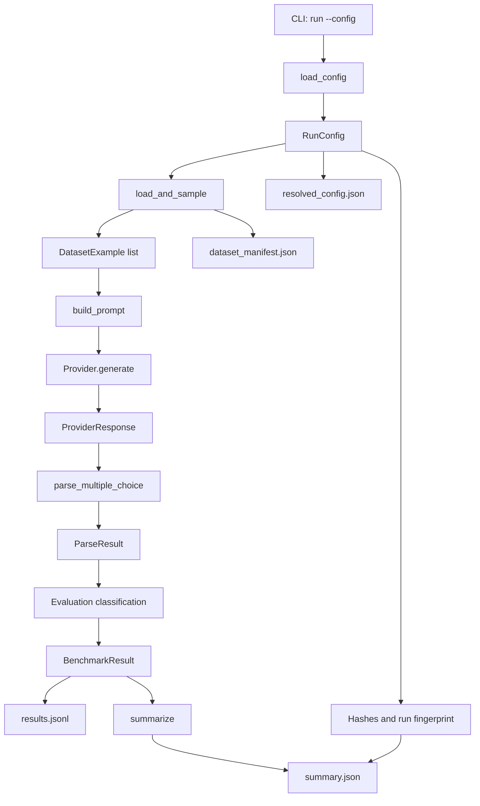
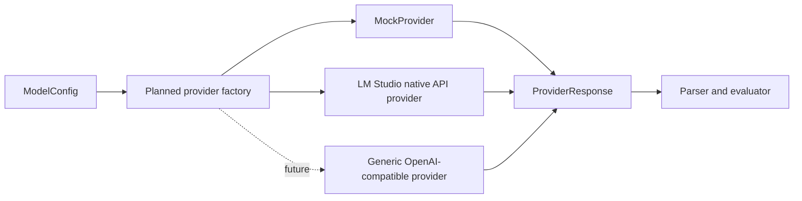
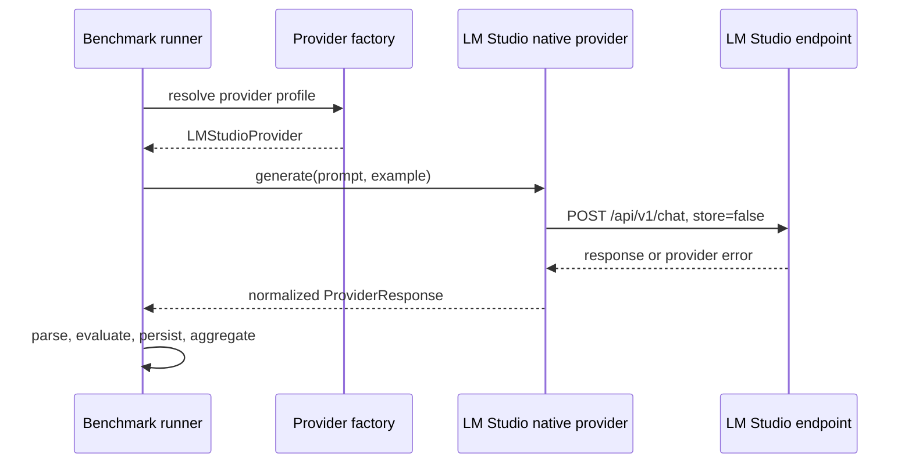

# Architecture

## Design goals

The project aims to make model-service comparisons reproducible and auditable.
Dataset selection, prompts, request configuration, parsing rules, evaluation,
and measurement metadata are explicit inputs rather than hidden runtime state.
The current implementation remains intentionally small while preserving clear
extension points for real providers and additional task types.

## Component responsibilities

| Component | File | Responsibility |
| --- | --- | --- |
| CLI | `src/llm_benchmark/cli.py` | Parse commands and overrides, load config, start a run, and print a concise result |
| Configuration | `src/llm_benchmark/config.py` | Safely load YAML and validate immutable, strict Pydantic models |
| Data models | `src/llm_benchmark/models.py` | Define normalized examples, provider responses, parser results, and benchmark records |
| Dataset layer | `src/llm_benchmark/datasets.py` | Load local JSONL or pinned MMLU-Pro data, normalize rows, sample deterministically, and build manifests |
| Prompt layer | `src/llm_benchmark/prompting.py` | Build versioned multiple-choice prompts and hash the template |
| Provider layer | `src/llm_benchmark/providers.py` | Define the provider protocol, factory, deterministic MockProvider, and isolated LM Studio native provider |
| Parser | `src/llm_benchmark/parser.py` | Convert generated text to a deterministic allowed answer label or an explicit parse failure |
| Runner/evaluation | `src/llm_benchmark/runner.py` | Orchestrate the run, classify each result, persist records, and assemble summaries |
| Metrics | `src/llm_benchmark/metrics.py` | Aggregate quality, reliability, token, latency, and error metrics |
| Storage | `src/llm_benchmark/storage.py` | Append JSONL results and atomically replace JSON artifacts |
| Reproducibility | `src/llm_benchmark/reproducibility.py` | Build canonical hashes and capture runtime/Git metadata |

## End-to-end data flow

## Provider architecture

The provider boundary is represented by the `Provider` protocol. Providers
normalize their native response or failure into `ProviderResponse`, allowing
prompting, parsing, evaluation, metrics, and storage to remain provider-neutral.

The runner resolves one provider instance per model profile through
`create_provider()`. LM Studio native handling is deliberately separate from a
future generic OpenAI-compatible provider.

## Current MockProvider path

1. `ModelConfig` supplies a model ID, deterministic scenario cycle, optional
   sample-specific overrides, and synthetic latency.
2. `MockProvider._scenario()` derives a repeatable scenario from `sample_id`.
3. `MockProvider.generate()` returns a correct, incorrect, ambiguous, failed,
   or missing-usage response without network access or sleeping.
4. Token counts are deterministic whitespace-based counts.
5. `runner._evaluate()` parses and classifies the response.
6. The runner appends a `BenchmarkResult` and later derives summaries.

This path validates the benchmark software, not an LLM.

## LM Studio native API path

The implemented local-provider path connects to an already running LM Studio
native endpoint. The benchmark does not manage the LM Studio process, model
download, model loading, or local model lifecycle.

Conceptually:

The provider submits an explicit reasoning mode and scores only native output
items whose type is `message`. Reasoning items contribute only telemetry and
are never parsed as final answers. The normalized response can include input,
total-output, reasoning-output, safely derived final-output, TTFT, throughput,
stop-reason, and sanitized HTTP/provider-error fields. Optional supported
sampling values are omitted from the native payload unless explicitly set.
A generic OpenAI-compatible adapter remains a separate future provider.

The native provider path has been validated with the one-question local
fixture, the pinned 14-question reasoning-off MMLU-Pro smoke profile, a
reasoning-on 14-question profile, and bounded single-sample calibrations. All
paths remain sequential and use the same strict standalone-label parser
contract.

## Phased roadmap

### Phase 1 — Completed validation core

- Strict YAML/Pydantic configuration
- Local fixture and pinned MMLU-Pro dataset sources
- Deterministic prompt, parser, MockProvider, evaluation, and metrics
- JSONL/JSON artifacts and reproducibility metadata
- Offline unit and integration tests

### Phase 2 — Controlled local-provider POC

- Provider factory and isolated LM Studio native adapter
- One validated localhost model profile with configurable reasoning and
  partial native-supported sampling controls
- Normalized provider usage, returned-model, reasoning/final-output telemetry,
  and sanitized error metadata
- Fixture or pinned smoke workload only

### Phase 3 — Reliable execution

- Attempt-level persistence
- Connect/read/logical timeouts
- Bounded retries and backoff
- Concurrency and quota-bucket rate limiting
- Graceful shutdown and configuration-safe resume

### Phase 4 — Durable comparison and reporting

- Versioned pricing and cost calculation
- SQLite/PostgreSQL storage
- CSV exports and Pareto comparisons
- Backend API and a later web interface

### Phase 5 — Additional evaluation families

- Structured output and instruction following
- Tool calling with deterministic mock tools
- Embedding and retrieval
- RAG
- Open-ended and code-generation evaluation with appropriate safety controls
- Calibrated LLM-judge and human evaluation only when deterministic methods are
  insufficient

Later dedicated phases may evaluate opt-in reasoning diagnostics, repetition
analysis, difficulty calibration suites, and provider/model capability
metadata. They are intentionally not implemented in the current branch.
