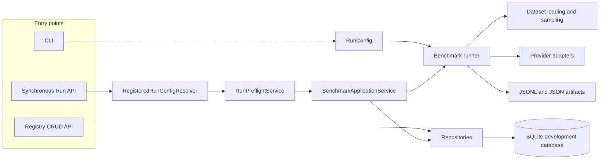
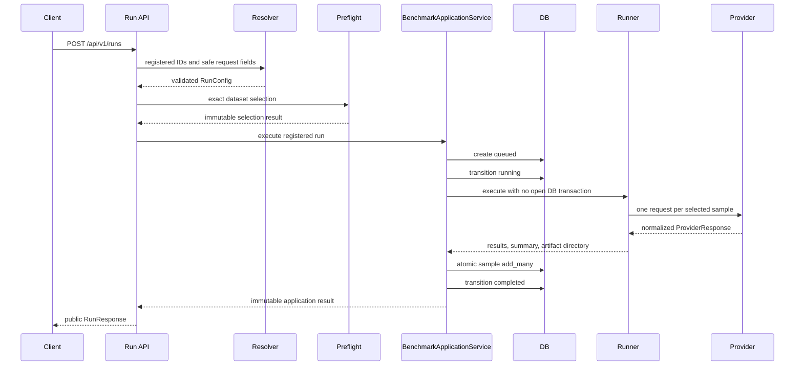
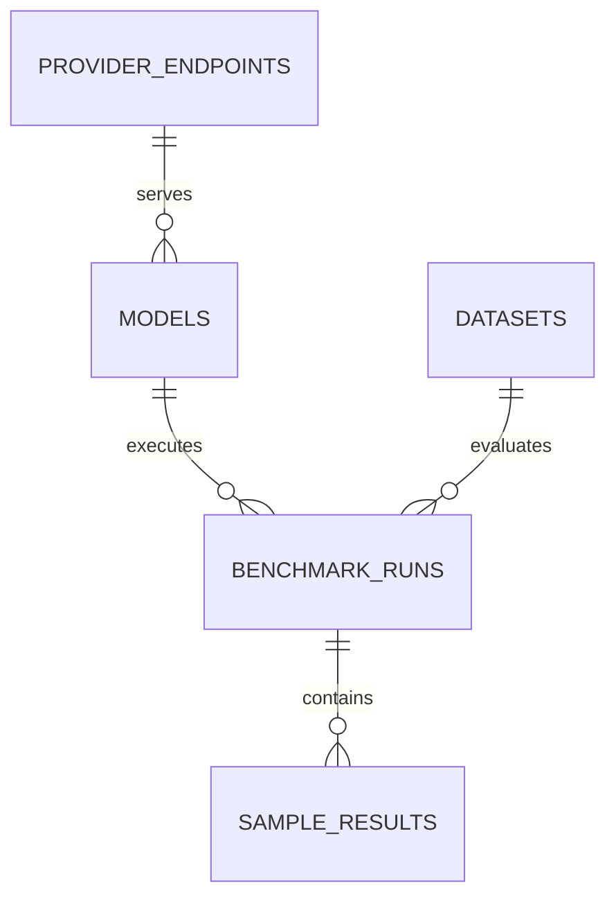
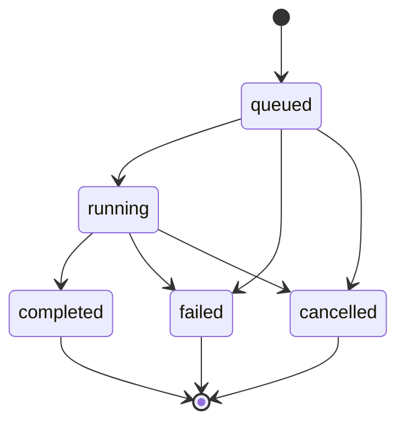
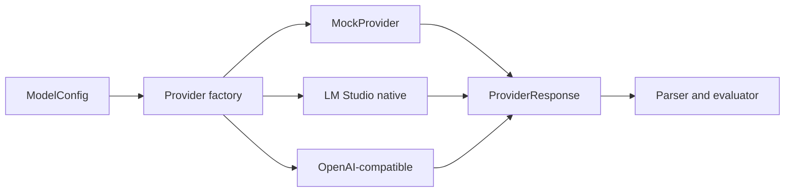
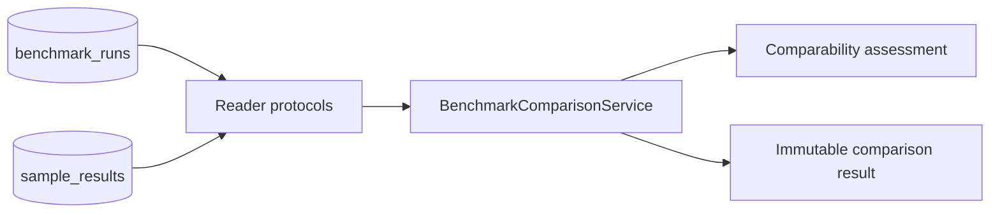

# Architecture

## Design goals

The project separates benchmark semantics from transport, persistence, and HTTP
delivery. Dataset selection, prompt construction, parsing, scoring, request
configuration, and measurement metadata remain explicit and reproducible.

The implementation currently provides two execution paths:

- The CLI directly executes a validated YAML configuration and writes
  filesystem artifacts.
- The synchronous Run API resolves registered resources, preflights the exact
  workload, executes through an application service, and persists both
  artifacts and database records.

## Component responsibilities

| Component | Primary file | Responsibility |
| --- | --- | --- |
| CLI | `src/llm_benchmark/cli.py` | Load YAML, apply explicit overrides, call the runner, print a concise result |
| Configuration | `src/llm_benchmark/config.py` | Strict immutable Pydantic configuration and canonical serialization inputs |
| Dataset layer | `src/llm_benchmark/datasets.py` | Local or pinned Hugging Face loading, normalization, filtering, deterministic sampling, manifest construction |
| Prompt layer | `src/llm_benchmark/prompting.py` | Versioned multiple-choice prompt and template hash |
| Provider layer | `src/llm_benchmark/providers.py` | Provider protocol, factory, Mock, LM Studio native, and OpenAI-compatible adapters |
| Parser | `src/llm_benchmark/parser.py` | Strict deterministic parsing against actual allowed labels |
| Runner | `src/llm_benchmark/runner.py` | Execute samples, classify results, write artifacts, aggregate metrics |
| Metrics | `src/llm_benchmark/metrics.py` | Quality, reliability, token, latency, and category aggregation |
| Artifact storage | `src/llm_benchmark/storage.py` | Append JSONL and atomically replace individual JSON files |
| Reproducibility | `src/llm_benchmark/reproducibility.py` | Canonical hashes and runtime/Git environment metadata |
| Database foundation | `src/llm_benchmark/db/engine.py`, `models.py` | SQLAlchemy engine/session, portable ORM schema, SQLite foreign keys |
| Repositories | `src/llm_benchmark/db/repositories.py` | Transactional persistence rules and immutable records |
| Registered config resolver | `src/llm_benchmark/run_resolution.py` | Build a safe RunConfig from active registry records |
| Run preflight | `src/llm_benchmark/run_preflight.py` | Apply synchronous API limits and validate the exact dataset selection |
| Application service | `src/llm_benchmark/application.py` | Run lifecycle, short transaction boundaries, runner invocation, result persistence |
| Comparison service | `src/llm_benchmark/comparison.py` | Read two completed runs through reader protocols, validate strict comparability, and return immutable comparisons |
| FastAPI boundary | `src/llm_benchmark/api/` | Strict schemas, dependency wiring, thin CRUD and Run routes, safe HTTP errors |

## Overall architecture



## CLI execution

```text
YAML + --set overrides
-> load_config
-> immutable RunConfig
-> run_benchmark / execute_benchmark
-> dataset loading and sampling
-> prompt / provider / parser / evaluation
-> results.jsonl and JSON artifacts
```

The CLI does not use repositories, the application service, or Run API
guardrails. Its configured `full` profile remains available.

## Registry API

The registry API exposes CRUD operations for endpoint, model, and dataset
registrations. Lists return active records; individual GET requests may return
soft-deleted records for historical administration. Routes use strict Pydantic
schemas and repositories rather than ORM objects.

Only a credential environment-variable name may be stored. Secret values are
rejected and resolved only by a provider at request time when configured.

## Registered Run API sequence



If runner execution or required persistence fails after run creation, the
application service attempts to transition the run to `failed`. Unparseable and
request-failed samples remain benchmark outcomes when the pipeline itself
completes.

## Run API preflight

The default immutable `RunApiGuardrailPolicy` allows `smoke` and `poc`, rejects
`full`, limits exact selected samples to 100, and limits explicit sample IDs to
100. It performs cheap limits before dataset loading and exact count validation
after reusing the existing `sample_examples()` implementation.

Unknown IDs, unknown categories, mixed valid/invalid categories, and empty
selections are rejected before `BenchmarkApplicationService` is called. A
rejected preflight creates no provider request, database row, or artifact
directory.

Preflight and execution currently load the dataset independently. This avoids
changing runner and CLI contracts but leaves duplicate I/O and a theoretical
time-of-check/time-of-use boundary.

## Persistence relationships



SQLAlchemy 2.x uses SQLite by default for local/development persistence. The
schema uses generic JSON and portable enum/check-constraint storage for a
future PostgreSQL migration, but PostgreSQL runtime behavior has not been
validated. Alembic currently provides the initial schema migration.

Endpoints, models, and datasets use soft deletion. Foreign keys protect
historical runs; there is no destructive cascade from registry records to run
history. Sample bulk insertion is atomic.

## Run lifecycle



Completed, failed, and cancelled are terminal states. Each repository write
uses a short explicit transaction. No database transaction remains open during
provider execution.

## Provider architecture

`create_provider()` selects one adapter per model profile:



The LM Studio adapter calls native `POST /api/v1/chat`, sends `store=false`,
and parses only `type=message` output as the final answer. The generic adapter
calls `POST {base_url}/chat/completions` and scores only standard message
content. Native reasoning output is telemetry and is never scored directly.

## Artifacts and database boundaries

Runner artifacts are:

- `results.jsonl`
- `summary.json`
- `resolved_config.json`
- `dataset_manifest.json`
- `environment.json`

CLI runs write under `outputs/<run_id>/`. Registered Run API executions use
`outputs/api/<run_id>/` by default and additionally persist run/sample records.
Filesystem artifacts and database records are deliberately both retained, but
they do not form a single cross-storage transaction.

## Current security and operational boundaries

- The API has no authentication or authorization.
- Execution is synchronous and in-process.
- There is no worker, queue, retry, concurrency control, pagination, or resume.
- There is no endpoint SSRF allowlist or dataset-root allowlist.
- There is no explicit Hugging Face network/cache policy at the API boundary.
- Raw model responses are exposed by the sample-result API.
- Public run responses do not expose persisted internal error messages.
- Actual credentials are never persisted; only environment-variable names may
  be registered.
- The API is not production-ready.

## Phase 5A strict run comparison

`BenchmarkComparisonService` is a framework-independent, read-only application
service. It depends on reader protocols for benchmark runs, sample results,
models, datasets, and endpoints. It does not import ORM models, write database
rows, read or write artifacts, or expose an HTTP route.



Both run IDs must be distinct, both runs must be `completed`, and each must
contain sample rows. Strict mode requires identical sample-ID populations.
Rows are indexed and sorted by `sample_id`, so alignment does not depend on
database row order. Duplicate IDs, empty runs, asymmetric populations, and
correct-answer or category mismatches raise typed comparison errors.

Comparability differences have three roles:

- Blocking: dataset identity/source, revision, split, task type, adapter,
  prompt-template hash, parser version, evaluator version, or scoring mode.
- Contextual: model identity is expected; endpoint and provider identity are
  reported as serving context.
- Conditional: reasoning policy/mode, temperature, sampling parameters,
  timeout, seed, fixed/provider-default output budgeting, and other supported
  generation settings limit causal attribution but do not discard the result.

Supported metrics are recomputed from persisted sample rows rather than copied
from summary aggregates. `summary_json` is used only for required provenance,
run wall time, and consistency warnings. Quality, format compliance,
reliability, token usage, and latency remain separate; there is no universal
composite score. Results include aggregate, per-category, and per-sample
comparisons and request/parse/evaluation transitions.

Null optional metrics remain null. Each optional metric carries
`available_count`, `missing_count`, and `complete`. Successful-request P50/P95
values use available non-null latency observations, while coverage uses the
total successful-request population. Incomplete coverage remains
`complete=false`, and no delta is emitted when either side is incomplete.

Comparison records use an explicit safe-field allowlist. They exclude raw
responses, provider and internal run error messages, endpoint URLs, credential
environment-variable names, dataset URIs and local paths, artifact directories,
and unrestricted registry metadata.

Phase 5A does not support partial-overlap comparison, attempt/retry/backoff
analysis, stop-reason or HTTP/provider-code comparison, final-output-token
comparison, cost comparison, or a FastAPI comparison endpoint. Some of those
features require additional persisted data or a separate product contract.

## Next architectural increments

- Safe Comparison API over the completed strict comparison service
- Authentication and endpoint/path policies
- Async worker execution, cancellation, retry, and resume
- PostgreSQL runtime validation
- Pricing and cost calculation
- Additional deterministic task families
- Frontend only after stable API and operational boundaries
